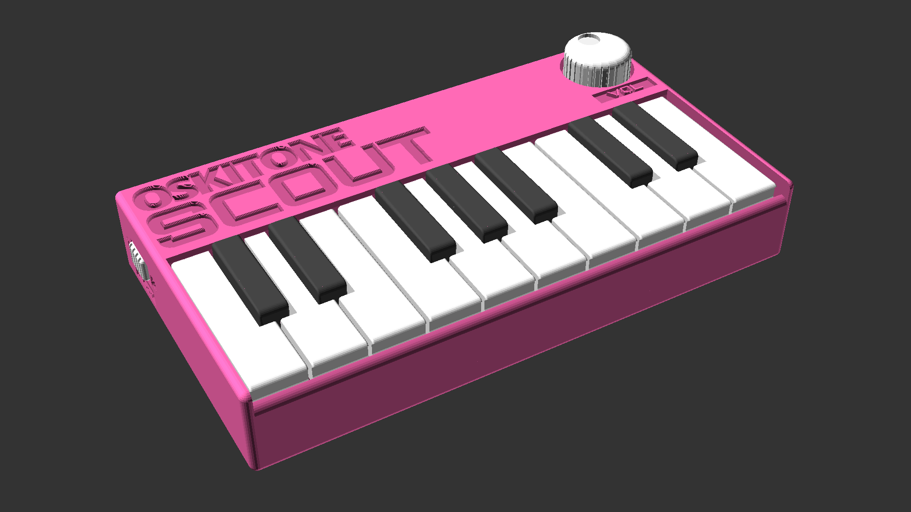

# Scout

## Goals

Quickest "Time-to-Noise" (TTN) from starting kit to making noise with it:

- Minimum number of components for reduced build time
- Ideally 0 off-board connections; no ribbon cable,
- Able to print on "mini" (18x18x18cm) sized 3D printers
- Built-in speaker
- Minimum octave of notes
- Volume control

Any secondary features should be optional; circuit must function w/o them:

- Line-out jack
- Octave control

Doesn't need to include but documentation should address:

- CV, MIDI or other IO
- Polyphony
- Wave types besides square, envelopes, portamento, vibrato

## Annotated BOM

Based on KiCad board BOM, with non-essential footprints removed and usages explained.

| Designator | Designation        | Quantity | Marking              | Usage                                               |
| ---------- | ------------------ | -------- | -------------------- | --------------------------------------------------- |
| BT1        | 4.5v               | 1        | n/a                  | Power; wires to 3\*AAA battery pack                 |
| C1,C5      | 220uF              | 1        | n/a                  | Big bypass cap, Amp output                          |
| C3         | 1uF                | 1        | n/a                  | Amp gain                                            |
| C2,C4,C6   | .1uF               | 3        | 104                  | Bypass caps, RESET pin cap (C4)                     |
| D1         | LED_CRGB           | 1        | n/a                  | On/off+playing indicators                           |
| J1         | AudioJack2_SwitchT | 1        | n/a                  | Line out headphone jack                             |
| J2         | Conn_01x06_Male    | 1        | n/a                  | Programming header                                  |
| LS1        | Speaker            | 1        | n/a                  | Wires to output speaker                             |
| R1,R2,R3   | 220                | 3        | Red Red Brown        | LED current limiters                                |
| R4         | 1k                 | 1        | Brown Black Red      | Brings volume closer to ear-safe level for line out |
| R5         | 330k               | 1        | Orange Orange Yellow | Drops volume even more before amp                   |
| R6         | 10k                | 1        | Brown Black Orange   | "Pull up" resistor for RESET pin                    |
| RV1        | 10k Log            | 1        | n/a                  | Volume control                                      |
| SW1        | SW_SPST            | 1        | n/a                  | On/off power switch                                 |
| SW2-SW18   | SPST               | 17       | n/a                  | Key buttons                                         |
| U1         | ATmega328P-PU      | 1        | n/a                  | Microcontroller chip                                |
| U2         | LM386              | 1        | n/a                  | Amplifier chip                                      |
| Y1         | 16.00MHz           | 1        | 160B                 | Ceramic oscillator for microcontroller              |

Also:

- 10" wire
  - BT1 6"
  - LS1 4"
- Battery terminal contacts for BT1
  - 2 dual spring+button wire contacts
  - 1 tabbed spring contact
  - 1 tabbed button contact
- 2 sockets
  - 1 28 pin for U1
  - 1 8 pin for U2

## License

Designed by Oskitone. Please support future synth projects by purchasing from [Oskitone](https://www.oskitone.com/).

Creative Commons Attribution/Share-Alike, all text above must be included in any redistribution. See license.txt for additional details.
