# Scout

**scout** (_/skout/_):

1. _One sent to obtain information_
2. _Jean Louise “Scout” Finch, of Atticus Finch_
3. _The first synth from Oskitone to venture into the big ol' world of microcontrollers_

The Scout is:

- **Beginner-friendly:** All components are through-hole (instead of surface mount) for easier soldering, and full assembly takes about 45min. Standalone, battery-powered, doesn't need a computer or external speakers to work. Fun!
- **3D-Printable:** Besides the electronics and nuts and bolts, all parts are 3D-printed. And with a total width of ~160mm (about 6.3"), the Scout can fit on smaller, "Mini" (18x18x18cm) size print beds.
- **Hackable:** Arduino-compatible and fully open source! Hook up an [FTDI Serial TTL-232 cable](https://www.adafruit.com/product/70) (sold separately) to update its code using the Arduino IDE.
- **Minimally featured:** 1.5 octaves of keys, a volume knob, on/off switch, speaker, headphone jack. Monophonic square wave with fixed glide and octave.

In addition to it being the first microcontroller-controlled instrument from Oskitone, the Scout would also make a fine introductory DIY instrument for the budding electronics hobbyist. (Some experience soldering and a general familiarity with how electricity works are recommended though!)

As such, it is intentionally minimal, with the goal of the shortest possible time from starting the kit to making music with it. No MIDI/CV or other IO, as is. If you're looking for a full-featured studio instrument, this ain't it, bub! :)

**Demo:** [https://vimeo.com/587660426](https://vimeo.com/587660426) 
**Purchase a kit:** [https://www.oskitone.com/product/scout-synth-diy-electronics-kit](https://www.oskitone.com/product/scout-synth-diy-electronics-kit) 
**Blog post:** [https://blog.tommy.sh/posts/scout/](https://blog.tommy.sh/posts/scout/)

## Detailed assembly steps

[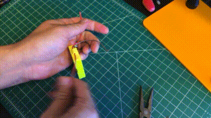](https://vimeo.com/586501851)

### Inventory

#### Required

- The [Oskitone Scout Synth DIY Electronics Kit](http://www.oskitone.com/product/scout-synth-diy-electronics-kit) and its 3D-printed parts
- Soldering iron and solder specifically for electronics
- Wire stripper or cutters
- 3 AAA batteries
- Headphones

#### Recommended

- Multimeter for debugging
- PCB vice or “helping hands” holder
- “Solder sucker” or desoldering braid
- Patience, patience, patience

### 3D-Printing

(If you bought a kit with 3D-printed parts included, you can skip this section, but do read below on [how to open the enclosure](#opening-the-enclosure) to confirm you have all the right pieces ready before continuing.)

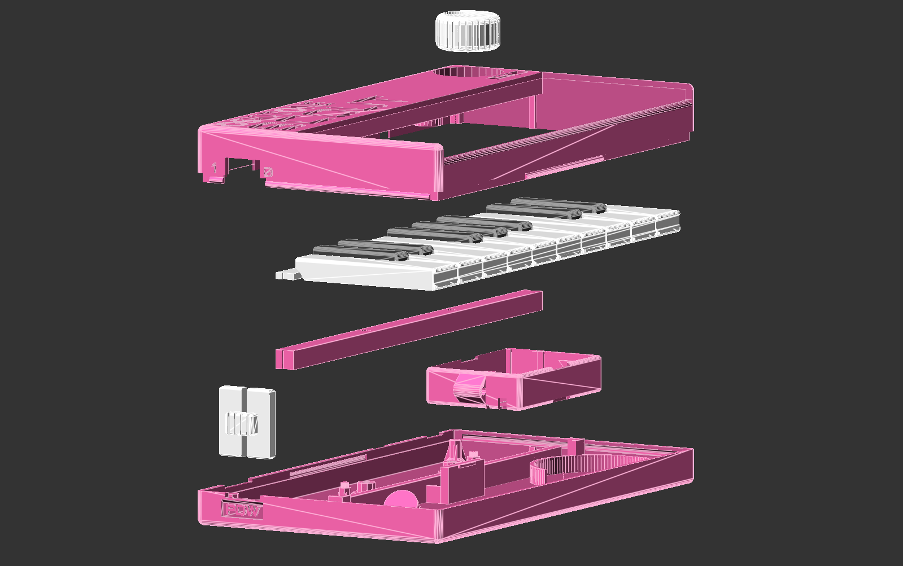

Download STLs of the models on Thingiverse: [https://www.thingiverse.com/thing:4933700](https://www.thingiverse.com/thing:4933700)

There are seven files to print, taking about 9 hours total.

| Part             | Layer Height | Supports? | Color change at height | Estimated Time |
| ---------------- | ------------ | --------- | ---------------------- | -------------- |
| battery_holder   | .2mm         | No        | n/a                    | 40min          |
| enclosure_bottom | .2mm         | No        | n/a                    | 1hr 10min      |
| enclosure_top    | .2mm         | No        | n/a                    | 3hr            |
| keys_mount_rail  | .2mm         | No        | n/a                    | 30min          |
| keys             | .2mm         | No        | 7.2mm                  | 3hr            |
| knob             | .2mm         | No        | n/a                    | 20min          |
| switch_clutch    | .2mm         | No        | n/a                    | 20min          |

**Notes:**

- Models assume Fused Deposition Modeling with a standard .4mm nozzle. Using a bigger nozzle will likely result in a loss of detail and possibly missing internal walls.
- Any supports they need they'll already have, and they'll also already rotated to the correct orientation for printing. If you're not using FDM, try the `*-no_support` STLs that don't have supports.
- Watch the first couple layers of the enclosure pieces while printing, especially around the text engravings -- if you see bad adhesion, stop the print to remedy the situation and start again.
- If the prints aren't fitting together well, check to see that the corners aren't bulging. See if your slicer has settings for "coasting" or "linear advance."
- The enclosure_top and switch_clutch both have narrow support walls that will break off when they're done printing.

### Detailed PCB soldering instructions

This is what we'll end up with when we're done:

Each group of steps in the Scout's assembly has a test at the end to make sure everything you just did is working as expected. If it doesn't work, don't fret! Look over the troubleshooting tips below. Don't move on in the instructions until you've got the test working.

1. **Assemble battery pack**
   1. Insert tabbed battery contact terminals
      1. The springed contact goes to the spot with a "-".
      2. The flat, button contact goes near "+". Its button should face inward towards where the battery will be.
      3. Fold their tabs over to hold them in place.
   2. Insert wire dual contacts
      1. Again, springs go to "-" and buttons to "+".
         
   3. Add wire
      1. Cut your ribbon cable into two pieces of about 7" and 3".
      2. With the battery holder oriented so its "+" contact tab is on the left and "-" on the right, thread the 7" ribbon cable through the hitch on the left, about halfway though, and then split the bottom pair of wires.
         
      3. Thread the darker wire of the now separated pair through the channel on the bottom of the battery holder and up through the right hitch. (Your ribbon cable will probably have different colors, and that's okay! A common convention is to use the darker color for "-" and the lighter one for "+".)
         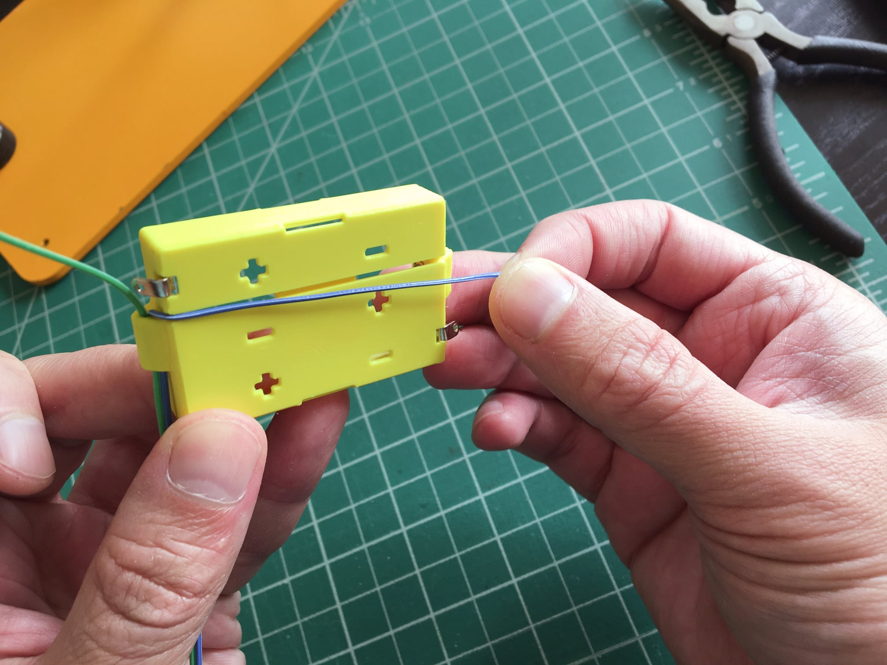
      4. Strip 1/4" of insulation off that right wire and solder to its contact tab.
      5. Cut the wire on the left to meet its tab, then strip and solder it.
      6. Separate and strip the other side of wires. Make sure they don't touch!
         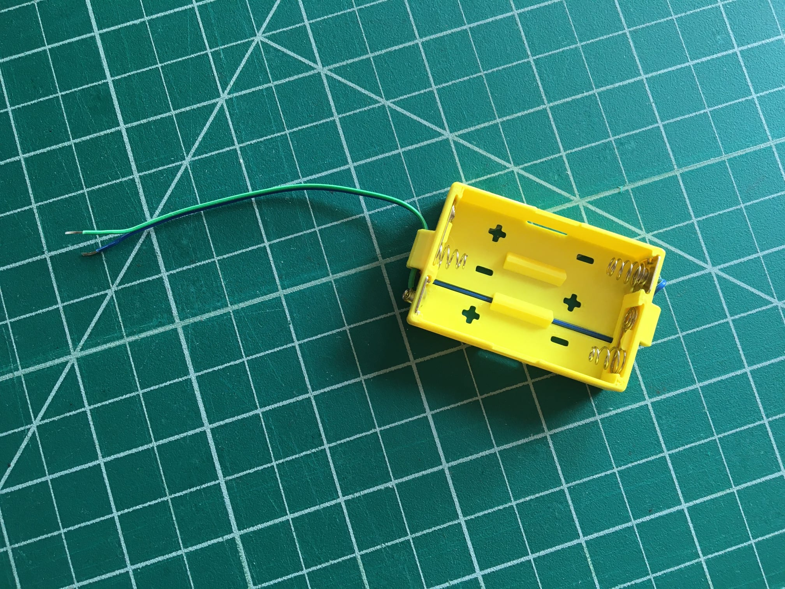
      7. Insert three AAA batteries, matching their "+" and "-" sides to the battery holder's labels.
      8. _TEST: Using a multimeter, measure the total voltage on those two wires. It should measure the sum of the three indivual batteries' voltages. When done, remove batteries to prevent accidentally draining them if the exposed wires touch._
         
2. **Power up**
   1. Solder LED at **D1**
      1. The LED has four pins for three different colors plus ground. The longest one is to ground and it goes to the hole that has a line coming out of it.
         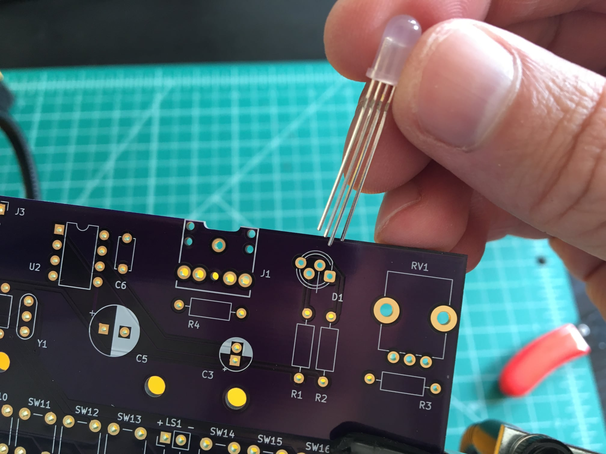
      2. Get the LED as vertically close to the PCB as reasonable; it doesn't have to be flat against PCB but does need to be straight up and down -- no leaning!
         
   2. Solder sliding toggle switch **SW1** and resistor **R1** (220).
      - Make sure the switch is flat against the PCB.
   3. Wire battery pack to **BT1**
      1. Thread the other side of the ribbon cable connected to the battery pack up through the hole near **BT1**, then strip and solder in place. Make sure the "+" and "-" wires are going to the right places.
   4. _TEST: Add the batteries back. Toggling **SW1** should now light one color of the LED! Power off before continuing soldering._
      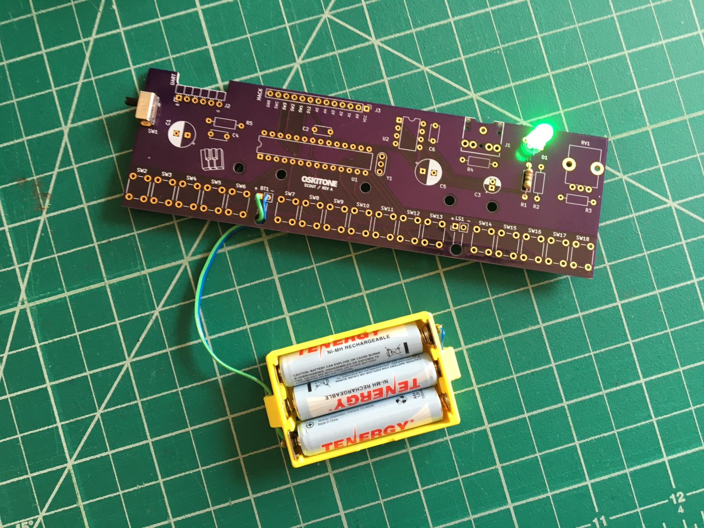
3. **Boot the microcontroller**
   1. Solder capacitors **C1** (220uF) and **C2** (.1uF), oscillator **Y1**, and resistors **R2** (220) and **R5** (10k).
      - **C1** has polarity. Match its white side to the white side of its footprint.
   2. Solder **U1** socket. It will have a dimple at one end, which should match the footprint on the PCB.
   3. With the power off, carefully insert **ATmega328**. It will have a dimple (and/or a small dot in a corner), which should match the socket.
   4. _TEST: Turn the power switch back on, and the LED should blink a new, different color a couple times. This lets you know that the ATmega is booted up and ready. Power off._
      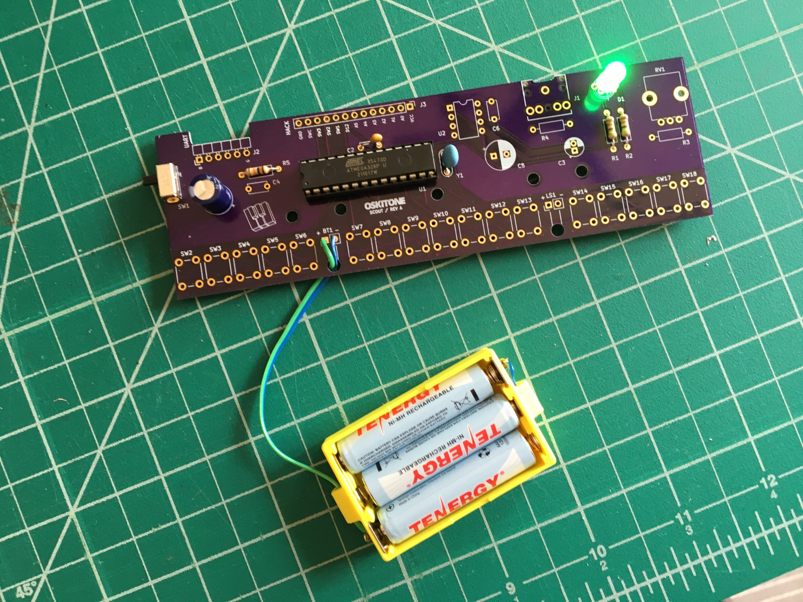
4. **Get logical**
   1. Solder an SPST switch to **SW2**.
      - **_Make sure the switch is absolutely flat against the PCB before soldering all of its pins._** One way to do this is to solder one pin to hold it in place, then use one hand to push it into the PCB while melting the solder with your other hand; if there's any gap there it should pop in. Visually inspect to make sure it's good, then repeat with the opposite pin. Then inspect and do the remaining pins. It takes time but is worth it.
   2. _TEST: With power on, press the switch. The LED should light just like it does on boot! Power off._
      
5. **Make some noise**
   1. Solder volume pot **RV1**, resistor **R3** (10k), and headphone jack **J1**.
      - Make sure **RV1** and **J1** are pushed all the way into PCB before soldering all the way.
   2. Connect your headphones into the headphone jack. Push firmly until it clicks in all the way.
   3. _TEST: With power on, turn up the volume with the potentiometer and press **SW2**. You should hear a tone from the headphones. Power off._
      
6. **Get loud**
   1. Solder capacitors **C5** (220uF) and **C6** (.1uF) and resistor **R4** (1m).
      - Make sure **C5**'s polariy matches its footprint, just like **C1**.
   2. Wire speaker to **LS1**.
      1. Thread remaining ribbon cable through hole.
         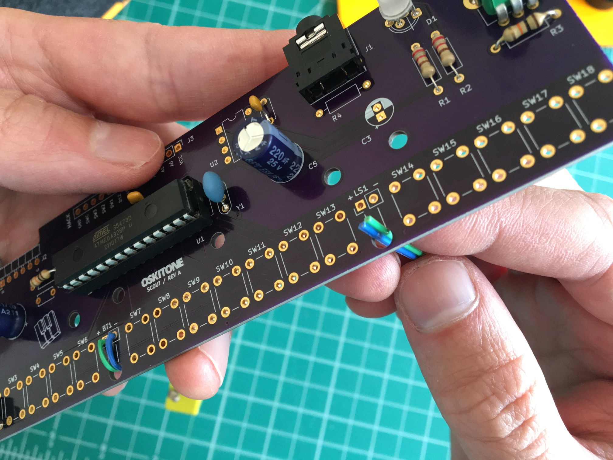
      2. Strip insulation and solder to **LS1**.
      3. Strip and solder the other ends to the speaker, matching the "+" and "-" sides.
   3. Solder socket **U2**. Match its dimple to the footprint, just like **U1**.
   4. With the power off, carefully insert **LM386** chip, again making sure its inserted the correct way.
   5. _TEST: Power on, unplug your headphones, and press the switch. It should be playing out of the speaker now. Power off._
      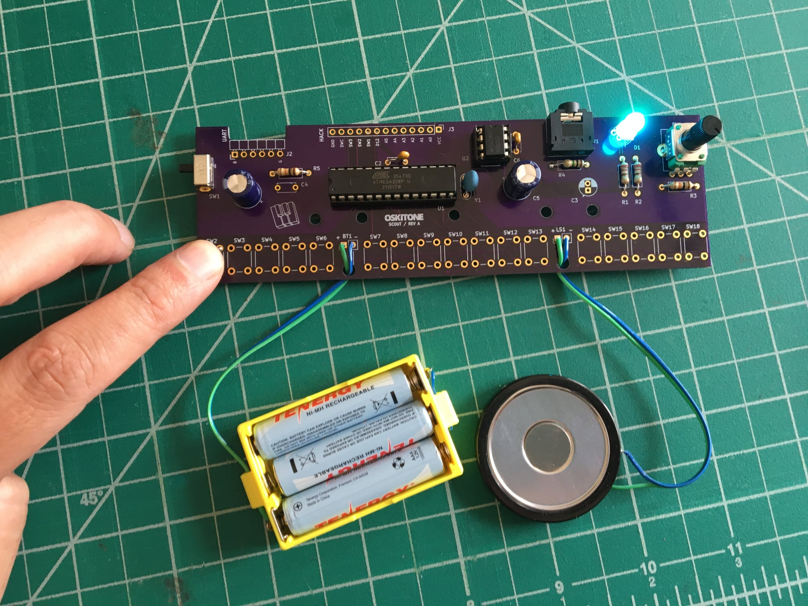
7. **More notes**
   1. Solder the remaining tactile 16 switches, **SW3** through **SW18**.
      - We want them all as flat against the PCB as **SW2**, so take your time here. They should line up perfectly!
   2. _TEST: Power on and press each. They should all play different notes out of the speaker. Power off._
      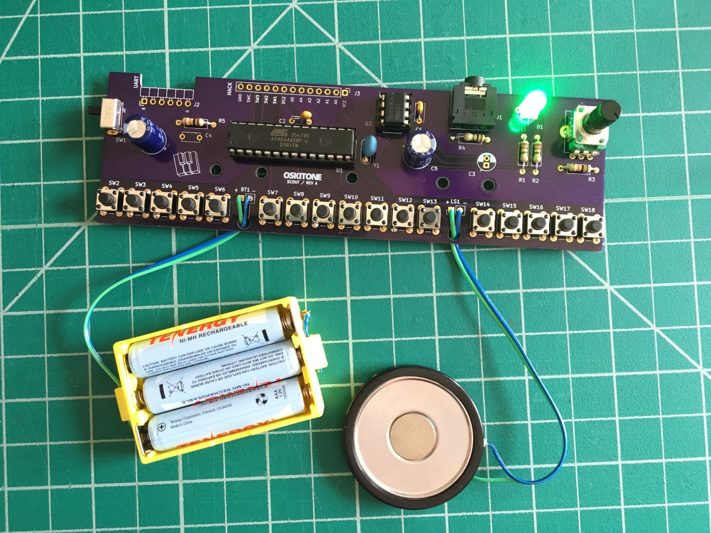
8. **Get louder (Optional. Skip if it's already loud enough for you!)**
   1. Solder cap **C3** (1uF).
      - Match polarity.
   2. _TEST: Power on and press some switches. The speaker should now be louder now! Power off._
9. **Prep for hacking (Optional. Skip if you don't plan on changing the code.)**
   1. Solder **J2** header and **C4** (.1uF) cap.
      - Try to get **J2**'s pins parallel to the PCB and sticking straight out.
   2. _TEST: See "Hacking" section below on how to use this!_
      

#### PCB troubleshooting

- Turn the PCB over and check all solder joints. A majority of problems are caused by insufficient or errant soldering. Familiarize yourself with what a good joint looks like in the [Adafruit Guide To Excellent Soldering](https://learn.adafruit.com/adafruit-guide-excellent-soldering).
- Are all chips in the right orientation? Each has a notch/dimple that should match the footprint outline on the PCB.
- Do the batteries have enough power? The three batteries should have a total voltage of 3.6 to 4.5 volts.
- If there’s buzzing, check for any metal scraps stuck to the speaker’s magnet.
- If some keys are touchy or behaving weird, check to see that they're inserted all the way and flat against the PCB.
- If you're hearing an unwanted hum from the speaker when the Scout isn't being played, verify all .1uF caps are soldered well. It may also be from noise added by long wires, so try to use the recommended wire lengths in this guide.

### Final assembly

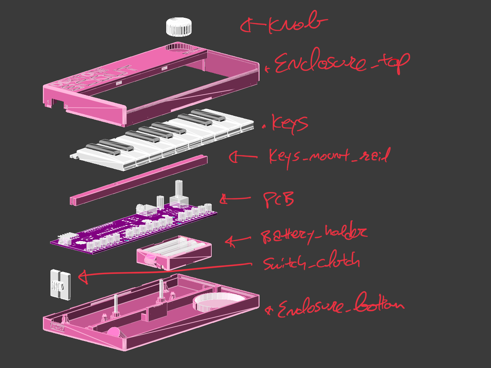

1. Assemble top
   1. Slide **square nuts** into nut locks on **enclosure top**. It'll be snug, but they'll fit! Use needle-nose pliers or a similar tool to push them in until their holes line up with those on the enclosure.
   2. Add the **keys**. Notice that 1) their rail has cavities on the sides that fit onto matching aligners on the enclosure and 2) the front of the keys have a cutout that matches an endstop on the enclosure, which will prevent the keys from being pressed too far down or being pulled up. Guide the keys down onto the aligners and into the endstop. It'll take some careful wiggling!
2. Assemble bottom
   1. Align **PCB** onto the **enclosure bottom**, nestled into its aligners.
   2. Pop the **speaker** into its cavity on the **enclosure bottom** with the speaker's shiny side up. Pop the **battery holder** into its cavity too. Orient them so that their wires are relatively contained within the space there and not poking up into where the keys will be.
   3. Add the **keys mount rail** onto its aligners and on top of the PCB.
   4. Add the **switch clutch** into its spot around the switch.
3. Finish
   1. Align **enclosure top** onto **enclosure bottom** and snap the two halves together. Try to make sure the **keys mount rail** and **keys** stay aligned as you do this.
   2. Fix **knob** onto the volume pot shaft, aligning its dimple to to the little marker on the top of the pot shaft.
   3. Slide two **machine screws** up through the bottom of the **enclosure bottom**.
      - If they don't insert easily, you may have something misaligned inside. Pop the enclosure back open (see below for help) and make sure the **PCB**, **keys mount rail**, and **keys** are all lined up correctly.
   4. Cautiosly tighten **screws** on bottom but not too tight! If you overtighten, the keys will get held down.

All done!

#### Assembly troubleshooting

- If the screws are hard to insert into the enclosure bottom, don't force them but look to see if the **keys mount rail** is in the way. It may have come loose from its aligners.
- A note is stuck on? The key mounting screw(s) may be too tight. Try loosening until the note turns off.
- A note turns off when pressing another near it? The key mounting screw(s) may be too loose. Try tightening.

### Opening the enclosure

Later, when you need to change the batteries (or maybe just want to admire your hard work!), you'll need to open the enclosure back up.

1. Unscrew bottom **machine screws**. They don't have to come all the way out, just loosen.
2. Pop off the volume **knob**. A flathead screwdriver (or similar tool) may help provide leverage.
3. Insert that same flat tool on the UART cavity or the horizontal gap on the back right, then wedge the enclosure apart.

[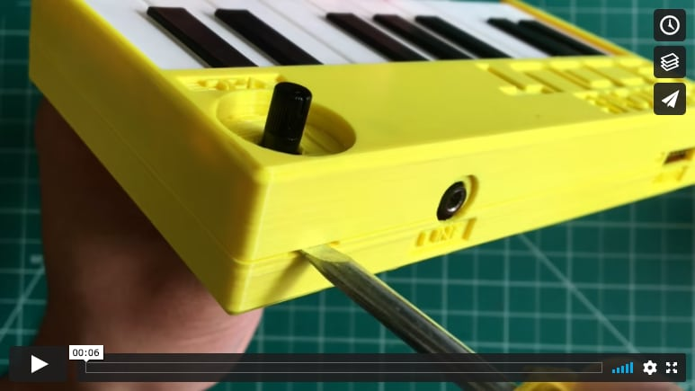](https://vimeo.com/589544440)

### Optional: Hacking!

Ready to experiment and get your hands dirty with some code?

1. Install the [Arduino IDE](https://www.arduino.cc/en/software) and follow their instructions to install whatever drivers you'd need for an Arduino Uno.
2. With the Scout's power off, use an [FTDI Serial TTL-232 cable](https://www.adafruit.com/product/70) to connect the Scout's UART header to your computer.
   1. The Scout's UART header has "B" and "G" labels on its sides to match the cables Black and Green wires.
   2. The cable provides power to the Scout, so it should now be on and working normally
   3. **Double check that the power switch is OFF!** Leaving it on can permanently damage the microcontroller or batteries!
3. In the IDE, under "Tools->Board", select "Arduino Uno". Under "Tools->Port" select your new cable; its exact name will depend on the brand. If you're not sure which it is, try unplugging and restarting the IDE -- whichever it was will no longer be listed, so you'll know which it is when reconnecting and restarting.
4. Download the code from this repo and load `arduino/scout.ino` in the Arduino IDE. You'll also need the `CircularBuffer` and `Keypad` libraries, so open up "Tools->Manage libraries" and search for those to install them.
   1. Try uploading this to the Scout by going to "Sketch->Upload". If it works, after 10 seconds or so, it will blink just like it does when you switch its power on. If it doesn't work, the IDE will print out an error that you can google to find out how to fix.
   2. Experiment with the `octave` and `glide` values at the top of `scout.ino` and observe how your Scout has changed its sound.
5. "Blink"
   1. The Arduino IDE has a default program called "Blink" (available in "File->Examples->Basics->Blink").
   2. After uploading, the Scout won't be playable anymore but one of the colors on the RGB LED should blink off and on.
   3. Try changing the delay values in the example to make it blink faster or slower.
   4. Follow the steps above to bring the original Scout code back.

Once you're comfortable with the Arduino code and really want to expand on what the Scout can do, take a look at the unpopulated HACK header on the PCB. It exposes all the unused pins on the ATmega328 that are safe to use for whatever you'd like:

| HACK         | ATmega pins | Description                                         |
| ------------ | ----------- | --------------------------------------------------- |
| VCC          | n/a         | Voltage from batteries or USB                       |
| A0-A5        | 23-28       | Analog pins                                         |
| D12          | 18          | There's only one unused digital pin, and this is it |
| SWC, SW1-SW3 | 16; 6,11,12 | Unused spots in the key matrix                      |
| GND          | n/a         | Ground                                              |

## Annotated BOM

| Designator | Designation        | Quantity | Marking            | Usage                                                                                 |
| ---------- | ------------------ | -------- | ------------------ | ------------------------------------------------------------------------------------- |
| BT1        | 3.6v-4.5v          | 1        | n/a                | Power; wires to 3\*AAA battery pack                                                   |
| C1,C5      | 220uF              | 1        | n/a                | Big bypass cap, Amp output                                                            |
| C3         | 1uF                | 1        | n/a                | Amp gain                                                                              |
| C2,C4,C6   | .1uF               | 3        | 104                | Bypass caps, RESET pin cap (C4)                                                       |
| D1         | LED_CRGB           | 1        | n/a                | On/off+playing indicators                                                             |
| J1         | AudioJack2_SwitchT | 1        | n/a                | Line out headphone jack                                                               |
| J2         | Conn_01x06_Male    | 1        | n/a                | Programming header                                                                    |
| LS1        | Speaker            | 1        | n/a                | Wires to output speaker                                                               |
| R1,R2      | 220                | 2        | Red Red Brown      | LED current limiters                                                                  |
| R3,R5      | 10k                | 1        | Brown Black Orange | Brings volume closer to ear-safe level for line out, "pull up" resistor for RESET pin |
| R4         | 1m                 | 1        | Brown Black Green  | Drops volume even more before amp                                                     |
| RV1        | 10k Log            | 1        | n/a                | Volume control                                                                        |
| SW1        | SW_SPST            | 1        | n/a                | On/off power switch                                                                   |
| SW2-SW18   | SPST               | 17       | n/a                | Key buttons                                                                           |
| U1         | ATmega328P-PU      | 1        | n/a                | Microcontroller chip                                                                  |
| U2         | LM386              | 1        | n/a                | Amplifier chip                                                                        |
| Y1         | 16.00MHz           | 1        | 160B               | Ceramic oscillator for microcontroller                                                |

Also:

- 2 2-wire ribbon cables (or similar small gauge, stranded wire)
  - 1 7" for BT1
  - 1 3" for LS1
- 4 battery terminal contacts for BT1
  - 2 dual spring+button wire contacts
  - 1 tabbed spring contact
  - 1 tabbed button contact
- 2 sockets
  - 1 28 pin for U1
  - 1 8 pin for U2
- 4 nuts and bolts
  - 2 4/40 square nuts
  - 2 4/40 3/4" machine screws

## 3D Models

The Scout's 3D-printed models are written in OpenSCAD.

### Dependencies

Assumes `poly555` and `apc` repos are in a sibling directory. Here's how I've got it:

    \ oskitone
        \ apc
        \ poly555
        \ scout

### Building

STLs are generated with `make_stls.sh`. Run `./make_stls.sh -h` for full flags list.

---

## License

Designed by Oskitone. Please support future synth projects by purchasing from [Oskitone](https://www.oskitone.com/).

Creative Commons Attribution/Share-Alike, all text above must be included in any redistribution. See license.txt for additional details.
